# 🏳️ NatPat Multi-Agent Customer Support System

> **Lookfor Hackathon 2026** — An AI-powered, multi-agent e-commerce customer support pipeline built with LangGraph, Claude (Anthropic), Shopify & Skio APIs.

---

## 📋 Table of Contents

- [Executive Summary](#-executive-summary)
- [System Architecture Overview](#-system-architecture-overview)
- [7-Layer Pipeline Architecture](#-7-layer-pipeline-architecture)
- [Agent Deep Dives](#-agent-deep-dives)
  - [Intent Classifier](#1-intent-classifier)
  - [Supervisor Agent](#2-supervisor-agent)
  - [WISMO Agent](#3-wismo-agent-where-is-my-order)
  - [Issue Agent](#4-issue-agent)
  - [Account Agent](#5-account-agent)
- [Guardrails System](#-guardrails-system)
  - [Input Guardrails](#input-guardrails-layer-1)
  - [Tool Call Guardrails](#tool-call-guardrails-layer-4)
  - [Output Guardrails](#output-guardrails-layer-5)
- [Reflection & Revision](#-reflection--revision-system)
- [Escalation & Handoff Mechanism](#-escalation--handoff-mechanism)
- [State Management](#-state-management)
- [Tool Ecosystem](#-tool-ecosystem)
- [Tracing & Observability](#-tracing--observability)
- [Tech Stack](#-tech-stack)
- [API Reference](#-api-reference)
- [Project Structure](#-project-structure)

---

## 🎯 Executive Summary

NatPat Multi-Agent CS is a **production-grade, multi-agent customer support system** that autonomously handles e-commerce support tickets for the NatPat brand. The system features:

- **3 Specialized ReAct Agents** — each with domain-specific workflows, tools, and prompt engineering
- **7-Layer Processing Pipeline** — from input sanitization to reflection-based quality assurance
- **3-Tier Guardrail System** — input, tool-call, and output guardrails preventing unsafe or incorrect responses
- **Autonomous Escalation** — health concerns, chargeback threats, and unresolvable issues are automatically escalated to human agents
- **Cross-Agent Handoff** — seamless routing between agents when customer intent shifts mid-conversation
- **Full Observability** — every decision, tool call, and reasoning step is traced for debugging and auditing

The system uses **Claude Sonnet** for complex reasoning and agent responses, and **Claude Haiku** for fast, cheap classification and reflection tasks.

---

## 🏗 System Architecture Overview

```mermaid
graph TB
    subgraph CLIENT["🖥️ Client Layer"]
        UI["Streamlit UI<br/>Chat + Trace Timeline"]
    end

    subgraph API["⚡ API Layer"]
        FAST["FastAPI Server<br/>v3.0"]
    end

    subgraph GRAPH["🧠 LangGraph Pipeline"]
        direction TB
        L0["Layer 0: Escalation Lock"]
        L1["Layer 1: Input Guardrails"]
        L2["Layer 2: Intent Classification"]
        L3["Layer 3: ReAct Agents"]
        L4["Layer 4: Tool Call Guardrails"]
        L5["Layer 5: Output Guardrails"]
        L6["Layer 6: Reflection Validator"]
        L7["Layer 7: Revision"]
    end

    subgraph TOOLS["🔧 External APIs"]
        SHOP["Shopify Admin API<br/>14 Tools"]
        SKIO["Skio Subscription API<br/>5 Tools"]
    end

    subgraph STORAGE["💾 Persistence"]
        SQLITE_HIST["history.db<br/>Session Metadata"]
        SQLITE_CP["history.db<br/>LangGraph Checkpointer"]
    end

    subgraph MODELS["🤖 AI Models"]
        SONNET["Claude Sonnet 4<br/>Reasoning + Responses"]
        HAIKU["Claude Haiku 4.5<br/>Classification + Reflection"]
    end

    UI <-->|HTTP| FAST
    FAST <--> GRAPH
    GRAPH <-->|Tool Calls| TOOLS
    GRAPH <-->|State| STORAGE
    GRAPH <-->|Inference| MODELS

    style CLIENT fill:#f0f4ff,stroke:#4a6cf7,stroke-width:2px
    style API fill:#fff4e6,stroke:#f59e0b,stroke-width:2px
    style GRAPH fill:#f0fdf4,stroke:#22c55e,stroke-width:2px
    style TOOLS fill:#fef2f2,stroke:#ef4444,stroke-width:2px
    style STORAGE fill:#f5f3ff,stroke:#8b5cf6,stroke-width:2px
    style MODELS fill:#fdf2f8,stroke:#ec4899,stroke-width:2px
```



---

## 🔄 7-Layer Pipeline Architecture

The core of the system is a **7-layer processing pipeline** implemented as a LangGraph `StateGraph`. Each customer message passes through these layers sequentially, with conditional routing at each stage.

```mermaid
flowchart TD
    START((Customer<br/>Message)) --> L0

    subgraph L0["Layer 0 — Escalation Lock"]
        EL{"Session<br/>Escalated?"}
    end

    EL -->|Yes| PE["Post-Escalation<br/>Auto-Response"]
    PE --> END1((🔒 END))

    EL -->|No| L1

    subgraph L1["Layer 1 — Input Guardrails"]
        IG["Sanitize & Validate"]
        IG --> IG_CHECK{"Pass?"}
    end

    IG_CHECK -->|Blocked| END2((🚫 END))
    IG_CHECK -->|Health Concern| AEH["Auto-Escalate<br/>Health"]
    IG_CHECK -->|Chargeback| AEC["Auto-Escalate<br/>Chargeback"]
    AEH --> ESC_HANDLER["Escalation Handler"]
    AEC --> ESC_HANDLER
    ESC_HANDLER --> END3((🚨 END))

    IG_CHECK -->|Clean - Turn 1| L2A
    IG_CHECK -->|Clean - Turn N| L2B

    subgraph L2["Layer 2 — Intent Classification"]
        L2A["Intent Classifier<br/>(First Message)"]
        L2B["Intent Shift Check<br/>(Multi-Turn)"]
    end

    L2A --> CONF{"Confidence<br/>≥ 80%?"}
    L2B --> SHIFT{"Intent<br/>Shifted?"}

    CONF -->|Yes| L3
    CONF -->|No| SUP["Supervisor Agent"]
    SHIFT -->|Same Agent| L3
    SHIFT -->|New Agent| L3

    SUP --> SUP_ROUTE{"Route?"}
    SUP_ROUTE -->|Agent| L3
    SUP_ROUTE -->|Direct| L5
    SUP_ROUTE -->|Escalate| ESC_HANDLER

    subgraph L3["Layer 3 — ReAct Agents"]
        WA["🚚 WISMO Agent"]
        IA["🔧 Issue Agent"]
        AA["👤 Account Agent"]
    end

    L3 --> L5

    subgraph L5["Layer 5 — Output Guardrails"]
        OG["Validate Response"]
        OG --> OG_CHECK{"Pass?"}
    end

    OG_CHECK -->|Escalation Detected| ESC_HANDLER
    OG_CHECK -->|Handoff Detected| HANDOFF["Handoff Router"]
    HANDOFF --> L3
    OG_CHECK -->|Failed| L7
    OG_CHECK -->|Passed| L6

    subgraph L6["Layer 6 — Reflection Validator"]
        RV["8-Rule QA Check"]
        RV --> RV_CHECK{"Pass?"}
    end

    RV_CHECK -->|Yes| END4((✅ END))
    RV_CHECK -->|No + Not Revised| L7
    RV_CHECK -->|No + Already Revised| END5((✅ END))

    subgraph L7["Layer 7 — Revision"]
        REV["Rewrite Response"]
    end

    L7 --> OGF["Output Guardrails<br/>(Final)"]
    OGF --> END6((✅ END))

    style L0 fill:#fff7ed,stroke:#f97316
    style L1 fill:#fef2f2,stroke:#ef4444
    style L2 fill:#eff6ff,stroke:#3b82f6
    style L3 fill:#f0fdf4,stroke:#22c55e
    style L5 fill:#fefce8,stroke:#eab308
    style L6 fill:#f5f3ff,stroke:#8b5cf6
    style L7 fill:#fdf2f8,stroke:#ec4899
```



### Layer Summary

| Layer | Name                  | Purpose                                                      | Model Used   |
| ----- | --------------------- | ------------------------------------------------------------ | ------------ |
| **0** | Escalation Lock       | Prevents further processing if session is already escalated  | None         |
| **1** | Input Guardrails      | PII redaction, injection detection, health/chargeback flags  | None (regex) |
| **2** | Intent Classification | Classifies customer intent + detects mid-conversation shifts | Haiku        |
| **3** | ReAct Agents          | Domain-specific reasoning, tool calling, response generation | Sonnet       |
| **4** | Tool Call Guardrails  | Validates parameters, enforces limits, prevents duplicates   | None (code)  |
| **5** | Output Guardrails     | Checks for forbidden phrases, persona, internal leaks        | None (regex) |
| **6** | Reflection Validator  | 8-rule quality check on final response                       | Haiku        |
| **7** | Revision              | Rewrites response to fix identified quality issues           | Sonnet       |

---

## 🤖 Agent Deep Dives

### 1. Intent Classifier

The intent classifier is a **2-stage system** using Claude Haiku for fast, cheap classification.


**Supported Intent Categories:**

| Intent          | Agent         | Description                                |
| --------------- | ------------- | ------------------------------------------ |
| `WISMO`         | wismo_agent   | Shipping delays, tracking, delivery status |
| `WRONG_MISSING` | issue_agent   | Wrong/missing items in package             |
| `NO_EFFECT`     | issue_agent   | Product not working, no results            |
| `REFUND`        | issue_agent   | Refund requests, money back                |
| `ORDER_MODIFY`  | account_agent | Cancel order, change address               |
| `SUBSCRIPTION`  | account_agent | Subscription management, billing           |
| `DISCOUNT`      | account_agent | Discount codes, promo issues               |
| `POSITIVE`      | account_agent | Compliments, happy feedback                |
| `GENERAL`       | supervisor    | Greetings, unclear, multi-topic            |

**Multi-Turn Shift Detection:**

On messages after the first, the system runs a **shift check** instead of full classification. If the new intent maps to a different agent and confidence ≥ 85%, the conversation is routed to the new agent.

---

### 2. Supervisor Agent

The Supervisor acts as a **fallback router** when the intent classifier has low confidence (< 80%).

```mermaid
flowchart TD
    LOW["Low Confidence<br/>Classification"] --> SUP["Supervisor Agent<br/>(Claude Sonnet)"]
    SUP --> ANALYZE["Analyze Customer<br/>Message"]
    ANALYZE --> DECIDE{"Decision"}

    DECIDE -->|"Shipping/Tracking"| WA["→ wismo_agent"]
    DECIDE -->|"Issues/Refunds"| IA["→ issue_agent"]
    DECIDE -->|"Account/Subs"| AA["→ account_agent"]
    DECIDE -->|"Simple Query"| RD["→ respond_direct<br/>(Supervisor answers)"]
    DECIDE -->|"Dangerous/Unclear"| ESC["→ escalate"]

    style SUP fill:#f0fdf4,stroke:#22c55e
```



The Supervisor uses **Claude Sonnet** to deeply analyze the message and outputs a structured routing decision in `ROUTE: | REASON:` format. If routing directly, it generates a response signed as "Caz".

---

### 3. WISMO Agent (Where Is My Order)

The WISMO Agent is the **shipping delay specialist**, handling all order tracking and delivery inquiries.


**WISMO Tools:** `shopify_get_customer_orders`, `shopify_get_order_details`, `shopify_add_tags`, `shopify_create_draft_order`

**Key Rules:**

- NEVER promise a specific delivery date
- NEVER say "guaranteed" or "definitely"
- Day-aware wait promise changes based on the day of the week
- Follow-up after wait promise → create draft order + escalate for reship

---

### 4. Issue Agent

The Issue Agent handles **wrong/missing items, product issues, and refunds** following a strict resolution priority waterfall.


**Issue Tools:** `shopify_get_order_details`, `shopify_get_customer_orders`, `shopify_refund_order`, `shopify_create_store_credit`, `shopify_create_return`, `shopify_add_tags`, `shopify_get_product_recommendations`, `shopify_get_product_details`, `shopify_get_related_knowledge_source`, `shopify_create_draft_order`

**Resolution Priority (NEVER skip steps):**

1. 🔧 **Fix the issue** — correct usage tips, product swap recommendation
2. 📦 **Free reship** — escalate to Monica for physical shipment
3. 💳 **Store credit** — with 10% bonus on item value
4. 💰 **Cash refund** — LAST RESORT only after customer declines all alternatives

---

### 5. Account Agent

The Account Agent manages **order modifications, subscriptions, discounts, and positive feedback**.

```mermaid
flowchart TD
    START["Account<br/>Request"] --> TYPE{"Request<br/>Type?"}

    TYPE -->|Cancel Order| WF_A
    TYPE -->|Address Update| WF_B
    TYPE -->|Subscription| WF_C
    TYPE -->|Discount Code| WF_D
    TYPE -->|Positive Feedback| WF_E

    subgraph WF_A["Workflow A — Order Cancellation"]
        A1["Look up order"] --> A2["Ask cancellation reason"]
        A2 --> A3{"Reason?"}
        A3 -->|Shipping Delay| A3a["Offer wait promise FIRST<br/>(day-aware rules)"]
        A3a -->|Refuses| A3a2["Cancel order"]
        A3 -->|Accidental| A3b["Cancel immediately<br/>+ refund original payment"]
        A3 -->|Other| A3c["Cancel if unfulfilled"]
    end

    subgraph WF_B["Workflow B — Address Update"]
        B1["Look up order"] --> B2{"Same-day order<br/>+ UNFULFILLED?"}
        B2 -->|Both true| B3["Update address<br/>+ add tags"]
        B2 -->|Either false| B4["ESCALATE:<br/>address_error"]
    end

    subgraph WF_C["Workflow C — Subscription"]
        C1["Check subscription<br/>status"] --> C2["Ask reason"]
        C2 --> C3{"Reason?"}
        C3 -->|Too many| C3a["Skip → 20% off →<br/>Cancel (waterfall)"]
        C3 -->|Quality issue| C3b["Product swap →<br/>Cancel"]
    end

    subgraph WF_D["Workflow D — Discount"]
        D1["Create 10% code<br/>(max 1 per session)"]
        D1 --> D2["Share code<br/>(48hr validity)"]
    end

    subgraph WF_E["Workflow E — Positive Feedback"]
        E1["Warm response<br/>with emojis 🥰"] --> E2["Ask for<br/>Trustpilot review"]
        E2 -->|Yes| E3["Share review link"]
        E2 -->|No| E4["'No problem at all!'"]
    end

    style WF_A fill:#fff7ed,stroke:#f97316
    style WF_B fill:#eff6ff,stroke:#3b82f6
    style WF_C fill:#f5f3ff,stroke:#8b5cf6
    style WF_D fill:#f0fdf4,stroke:#22c55e
    style WF_E fill:#fdf2f8,stroke:#ec4899
```



**Account Tools:** `shopify_get_order_details`, `shopify_get_customer_orders`, `shopify_cancel_order`, `shopify_update_order_shipping_address`, `shopify_add_tags`, `shopify_create_discount_code`, `shopify_get_product_recommendations`, `skio_get_subscription_status`, `skio_cancel_subscription`, `skio_pause_subscription`, `skio_skip_next_order_subscription`, `skio_unpause_subscription`

---

## 🛡 Guardrails System

The system implements a **3-tier guardrail architecture** that protects against unsafe inputs, incorrect tool usage, and inappropriate outputs.


### Input Guardrails (Layer 1)

| Check                          | Action                                           | Outcome                       |
| ------------------------------ | ------------------------------------------------ | ----------------------------- |
| Empty/Gibberish                | Block + friendly re-prompt                       | `input_blocked = True`        |
| Prompt Injection (14 patterns) | Block + redirect to CS scope                     | `input_blocked = True`        |
| PII Detection                  | Redact in-place (CC, SSN, email, phone, address) | Continue with cleaned input   |
| Length > 5000 chars            | Truncate                                         | Continue                      |
| Aggressive Language            | Flag for agent context                           | `flag_escalation_risk = True` |
| Chargeback Threat              | Auto-escalate                                    | → Escalation Handler          |
| Health Concern                 | Auto-escalate                                    | → Escalation Handler          |

### Tool Call Guardrails (Layer 4)

| Check                                        | Action                                  |
| -------------------------------------------- | --------------------------------------- |
| `shopify_get_order_details` with bare number | Auto-prefix with `#`                    |
| Action tools without `gid://shopify/...`     | **Block** execution                     |
| Cancel/refund without order ID               | **Block** execution                     |
| Discount code when already created (max 1)   | **Block** execution                     |
| Discount code values                         | **Force** to 10%, 48hr, percentage type |
| Store credit missing customer ID             | **Auto-fill** from session state        |
| Duplicate tool call (last 3 calls)           | **Block** execution                     |

### Output Guardrails (Layer 5)

| Check                                           | Action                      |
| ----------------------------------------------- | --------------------------- |
| `HANDOFF:` prefix detected                      | Route to Handoff Router     |
| `ESCALATE:` prefix detected                     | Route to Escalation Handler |
| Embedded HANDOFF/ESCALATE in body               | Flag as internal leak       |
| Forbidden phrases (9 patterns)                  | Fail → revision             |
| Missing "Caz" signature                         | Fail → revision             |
| Competitor brand mentions (6 brands)            | Fail → revision             |
| Refund > order total × 1.10                     | Fail → revision             |
| Response < 20 characters                        | Fail → revision             |
| Internal keywords (`gid://`, `tool_call`, etc.) | Fail → revision             |

---

## 🪞 Reflection & Revision System

After output guardrails pass, the response undergoes an **8-rule quality check** using Claude Haiku, followed by optional revision using Claude Sonnet.

```mermaid
flowchart TD
    DRAFT["Draft Response<br/>from Agent"] --> RV["Reflection Validator<br/>(Claude Haiku)"]

    RV --> R1["Rule 1: Resolution Order<br/>fix → reship → credit → refund"]
    RV --> R2["Rule 2: Wait Promise<br/>Day-aware correctness"]
    RV --> R3["Rule 3: Escalation Check<br/>Should this be escalated?"]
    RV --> R4["Rule 4: Information Gathering<br/>Asked necessary questions?"]
    RV --> R5["Rule 5: Tone & Persona<br/>Warm, empathetic, signed 'Caz'"]
    RV --> R6["Rule 6: Factual Accuracy<br/>Matches tool results?"]
    RV --> R7["Rule 7: GID vs Order Number<br/>Correct ID format per tool?"]
    RV --> R8["Rule 8: Resolution Waterfall<br/>Offered alternatives first?"]

    R1 & R2 & R3 & R4 & R5 & R6 & R7 & R8 --> CHECK{"All<br/>Pass?"}

    CHECK -->|"✅ All Pass"| SEND["Send to Customer"]
    CHECK -->|"❌ Rule Failed"| REVISE["Revision Node<br/>(Claude Sonnet)"]
    REVISE --> OG_FINAL["Output Guardrails<br/>(Final Pass)"]
    OG_FINAL --> SEND2["Send to Customer"]

    style RV fill:#f5f3ff,stroke:#8b5cf6
    style REVISE fill:#fdf2f8,stroke:#ec4899
```



**Important:** The revision cycle runs **at most once** (tracked by `was_revised` flag) to prevent infinite loops.

---

## 🔀 Escalation & Handoff Mechanism

### Cross-Agent Handoff

When a customer's request shifts outside an agent's domain, the agent emits a structured handoff command:

```
HANDOFF: target_agent | REASON: brief explanation
```



```mermaid
flowchart LR
    WA["🚚 WISMO Agent"] -->|"Customer wants refund"| HR["Handoff<br/>Router"]
    IA["🔧 Issue Agent"] -->|"Subscription query"| HR
    AA["👤 Account Agent"] -->|"Shipping status"| HR

    HR --> PARSE["Parse HANDOFF:<br/>target | reason"]
    PARSE --> VALID{"Valid<br/>Target?"}
    VALID -->|Yes| ROUTE["Route to<br/>Target Agent"]
    VALID -->|No| SUP["Fallback to<br/>Supervisor"]

    LIMIT{"Handoff<br/>Count ≥ 1?"} -->|Yes| SUP
    LIMIT -->|No| ROUTE

    style HR fill:#eff6ff,stroke:#3b82f6
```

**Loop Prevention:** Maximum **1 handoff per turn** (`handoff_count_this_turn`). If exceeded, falls back to Supervisor.

### Escalation Flow

Escalation happens via structured commands or automatic triggers:

```mermaid
flowchart TD
    subgraph TRIGGERS["Escalation Triggers"]
        T1["🏥 Health Concern<br/>(auto from input)"]
        T2["💳 Chargeback Threat<br/>(auto from input)"]
        T3["📦 Reship Needed<br/>(agent decision)"]
        T4["📍 Address Error<br/>(agent decision)"]
        T5["💰 Billing Error<br/>(agent decision)"]
        T6["🔄 Unresolved Loop<br/>(3+ turns)"]
        T7["❓ Uncertain<br/>(supervisor decision)"]
    end

    TRIGGERS --> ESC["Escalation Handler"]

    ESC --> SUMMARY["Generate Summary<br/>(Claude Sonnet)"]
    SUMMARY --> PAYLOAD["Build Escalation<br/>Payload"]
    PAYLOAD --> MSG["Customer Message:<br/>'Looping in Monica,<br/>Head of CS'"]
    MSG --> LOCK["🔒 Session Locked"]
    LOCK --> POST["All future messages →<br/>Post-Escalation Auto-Response"]

    style ESC fill:#fef2f2,stroke:#ef4444,stroke-width:2px
    style LOCK fill:#1f2937,stroke:#ef4444,color:#fff
```



**Escalation Payload includes:**

- Customer name, email, Shopify ID
- Order ID / Subscription ID (auto-resolved from tool call logs)
- Category, Priority (high if health/chargeback/billing)
- AI-generated summary of the conversation
- List of actions taken
- Last 10 conversation messages
- Draft order ID (if reship was prepared)

---

## 📦 State Management

The system uses a comprehensive `CustomerSupportState` TypedDict with **LangGraph's `add_messages` reducer** for message accumulation and **custom reducers** for reasoning logs.

```mermaid
classDiagram
    class CustomerSupportState {
        +list messages ← add_messages reducer
        +str customer_email
        +str customer_first_name
        +str customer_last_name
        +str customer_shopify_id
        +str ticket_category
        +int intent_confidence
        +bool intent_shifted
        +str current_agent
        +str current_order_id (GID)
        +str current_order_number (#XXXXX)
        +str current_subscription_id
        +float order_total
        +bool input_blocked
        +bool pii_redacted
        +bool output_guardrail_passed
        +list~str~ output_guardrail_issues
        +bool discount_code_created
        +int discount_code_created_count
        +float pending_refund_amount
        +bool flag_escalation_risk
        +bool flag_chargeback_threat
        +bool flag_health_concern
        +bool is_handoff
        +str handoff_target
        +int handoff_count_this_turn
        +bool reflection_passed
        +str reflection_feedback
        +str reflection_rule_violated
        +bool was_revised
        +bool is_escalated
        +dict escalation_payload
        +str escalation_reason
        +list~dict~ tool_calls_log
        +list~str~ actions_taken
        +list~str~ agent_reasoning ← append reducer
    }
```



**Persistence:** The state is checkpointed via `AsyncSqliteSaver` (LangGraph) into `history.db`, enabling full conversation history across sessions. Session metadata is separately stored in a SQLite table for the sidebar history UI.

---

## 🔧 Tool Ecosystem

### Shopify Tools (14 Tools)

| Tool                                     | Type   | ID Format                    | Description                      |
| ---------------------------------------- | ------ | ---------------------------- | -------------------------------- |
| `shopify_get_order_details`              | Lookup | `#XXXXX`                     | Fetch single order details       |
| `shopify_get_customer_orders`            | Lookup | Email                        | List customer orders (paginated) |
| `shopify_get_product_details`            | Lookup | Name/ID                      | Get product information          |
| `shopify_get_product_recommendations`    | Lookup | Keywords                     | Product recommendations          |
| `shopify_get_related_knowledge_source`   | Lookup | Question                     | FAQs, guides, articles           |
| `shopify_get_collection_recommendations` | Lookup | Keywords                     | Collection recommendations       |
| `shopify_cancel_order`                   | Action | `gid://shopify/Order/...`    | Cancel order (7 params)          |
| `shopify_refund_order`                   | Action | `gid://shopify/Order/...`    | Process refund                   |
| `shopify_create_store_credit`            | Action | `gid://shopify/Customer/...` | Issue store credit               |
| `shopify_add_tags`                       | Action | `gid://shopify/...`          | Add tags to resource             |
| `shopify_create_discount_code`           | Action | —                            | Create discount code             |
| `shopify_update_order_shipping_address`  | Action | `gid://shopify/Order/...`    | Update shipping address          |
| `shopify_create_return`                  | Action | `gid://shopify/Order/...`    | Create return                    |
| `shopify_create_draft_order`             | Action | —                            | Create draft order (reship prep) |

### Skio Subscription Tools (5 Tools)

| Tool                                | Description                        |
| ----------------------------------- | ---------------------------------- |
| `skio_get_subscription_status`      | Check subscription status by email |
| `skio_cancel_subscription`          | Cancel subscription with reasons   |
| `skio_pause_subscription`           | Pause until specific date          |
| `skio_skip_next_order_subscription` | Skip next subscription order       |
| `skio_unpause_subscription`         | Resume paused subscription         |

### Tool Assignment per Agent

```mermaid
graph LR
    subgraph WISMO["🚚 WISMO Agent — 4 Tools"]
        W1["get_customer_orders"]
        W2["get_order_details"]
        W3["add_tags"]
        W4["create_draft_order"]
    end

    subgraph ISSUE["🔧 Issue Agent — 11 Tools"]
        I1["get_order_details"]
        I2["get_customer_orders"]
        I3["refund_order"]
        I4["create_store_credit"]
        I5["create_return"]
        I6["add_tags"]
        I7["get_product_recommendations"]
        I8["get_collection_recommendations"]
        I9["get_product_details"]
        I10["get_related_knowledge_source"]
        I11["create_draft_order"]
    end

    subgraph ACCOUNT["👤 Account Agent — 12 Tools"]
        A1["get_order_details"]
        A2["get_customer_orders"]
        A3["cancel_order"]
        A4["update_order_shipping_address"]
        A5["add_tags"]
        A6["create_discount_code"]
        A7["get_product_recommendations"]
        A8["skio_get_subscription_status"]
        A9["skio_cancel_subscription"]
        A10["skio_pause_subscription"]
        A11["skio_skip_next_order"]
        A12["skio_unpause_subscription"]
    end

    style WISMO fill:#eff6ff,stroke:#3b82f6
    style ISSUE fill:#fef2f2,stroke:#ef4444
    style ACCOUNT fill:#f0fdf4,stroke:#22c55e
```



---

## 📊 Tracing & Observability

Every decision, tool call, and reasoning step is captured in a structured `SessionTrace` object.


The Streamlit UI displays traces in **real-time** alongside the chat interface, with a "Load Full Graph State" button for deep debugging.

---

## 🛠 Tech Stack

| Component                | Technology                                     |
| ------------------------ | ---------------------------------------------- |
| **Orchestration**        | LangGraph (StateGraph)                         |
| **LLM - Reasoning**      | Claude Sonnet 4 (`claude-sonnet-4-20250514`)   |
| **LLM - Classification** | Claude Haiku 4.5 (`claude-haiku-4-5-20251001`) |
| **API Framework**        | FastAPI                                        |
| **Frontend**             | Streamlit                                      |
| **State Persistence**    | AsyncSqliteSaver (LangGraph) + SQLite          |
| **HTTP Client**          | httpx (async + sync)                           |
| **E-Commerce**           | Shopify Admin API                              |
| **Subscriptions**        | Skio API                                       |
| **Schema Validation**    | Pydantic v2                                    |
| **Agent Pattern**        | ReAct (Reasoning + Acting)                     |
| **Language**             | Python 3.11+                                   |

---

## 📡 API Reference

| Endpoint              | Method | Description                                     |
| --------------------- | ------ | ----------------------------------------------- |
| `/health`             | GET    | Health check                                    |
| `/session/start`      | POST   | Start new support session                       |
| `/session/message`    | POST   | Send customer message, get agent response       |
| `/session/{id}/trace` | GET    | Get full session trace for observability        |
| `/sessions`           | GET    | List past sessions (optionally filter by email) |
| `/debug/set-time`     | POST   | Override system time for testing wait promises  |
| `/debug/clear-time`   | POST   | Clear time override                             |

### Example: Start Session

```json
POST /session/start
{
  "email": "sarah@example.com",
  "first_name": "Sarah",
  "last_name": "Jones",
  "customer_shopify_id": "gid://shopify/Customer/7424155189325"
}
```

### Example: Send Message

```json
POST /session/message
{
  "session_id": "session_abc123def456",
  "message": "Where is my order #43189?"
}
```

### Response

```json
{
  "session_id": "session_abc123def456",
  "response": "Hey Sarah! Let me look into order #43189 for you...\n\nCaz",
  "is_escalated": false,
  "actions_taken": [],
  "agent": "wismo_agent",
  "intent": "WISMO",
  "intent_confidence": 95,
  "was_revised": false,
  "intent_shifted": false
}
```

---

## 📁 Project Structure

```
natpat-multi-agent-cs/
├── main.py                          # FastAPI application & endpoints
├── history.db                       # SQLite — session metadata + LangGraph checkpoints
│
├── src/
│   ├── config.py                    # Environment, model instances, constants, time helpers
│   ├── database.py                  # Session metadata persistence (SQLite)
│   │
│   ├── graph/
│   │   ├── graph_builder.py         # LangGraph StateGraph — 7-layer pipeline
│   │   └── state.py                 # CustomerSupportState TypedDict
│   │
│   ├── agents/
│   │   ├── react_agents.py          # ReAct loop: WISMO, Issue, Account agents
│   │   ├── supervisor.py            # Supervisor fallback router
│   │   └── escalation.py            # Escalation handler + post-escalation lock
│   │
│   ├── patterns/
│   │   ├── guardrails.py            # Input / Output / Tool-call guardrails
│   │   ├── handoff.py               # Cross-agent handoff router
│   │   ├── intent_classifier.py     # 2-stage intent classification + shift detection
│   │   └── reflection.py            # 8-rule reflection validator + revision node
│   │
│   ├── prompts/
│   │   ├── wismo_prompt.py          # WISMO agent system prompt
│   │   ├── issue_prompt.py          # Issue agent system prompt
│   │   ├── account_prompt.py        # Account agent system prompt
│   │   ├── supervisor_prompt.py     # Supervisor agent prompt
│   │   ├── intent_classifier_prompt.py  # Haiku classification prompt
│   │   ├── reflection_prompt.py     # Reflection + revision prompts
│   │   └── shared_blocks.py         # Reusable prompt components
│   │
│   ├── tools/
│   │   ├── api_client.py            # Generic HTTP client with retry logic
│   │   ├── shopify_tools.py         # 14 Shopify tool wrappers
│   │   ├── skio_tools.py            # 5 Skio subscription tool wrappers
│   │   └── tool_groups.py           # Tool assignments per agent
│   │
│   └── tracing/
│       └── models.py                # TraceEntry, SessionTrace, build_session_trace
│
└── ui/
    └── app.py                       # Streamlit chat UI + trace timeline
```

---

## 🔑 Key Design Decisions

1. **Haiku for Classification, Sonnet for Reasoning** — Cost-optimized: fast/cheap Haiku handles classification and reflection, while powerful Sonnet handles complex agent reasoning and response generation.

2. **Manual ReAct Loop** — Instead of using LangGraph's `create_react_agent`, we implemented a custom ReAct loop for full control over tool call guardrails, state updates, and reasoning traces within each iteration.

3. **1-Cycle Revision Limit** — The reflection → revision loop runs at most once to prevent infinite correction cycles while still catching quality issues.

4. **Per-Turn State Reset** — Flags like `was_revised`, `handoff_count_this_turn`, and `is_handoff` are reset at the start of each turn (Layer 0) to prevent state pollution across turns.

5. **GID Auto-Resolution** — The escalation handler automatically resolves Shopify GIDs and subscription IDs from tool call logs, ensuring accurate escalation payloads even when agents don't explicitly track them.

6. **Day-Aware Wait Promises** — Different wait promise rules for WISMO vs. Cancellation/Refund contexts, with the current day injected into every prompt dynamically.

---

> **Built with ❤️ for the Lookfor Hackathon 2026**
