# 🏳️ NatPat Multi-Agent Customer Support System

> **Lookfor Hackathon 2026** — An AI-powered, multi-agent e-commerce customer support pipeline built with LangGraph, Claude (Anthropic), Shopify & Skio APIs.

---

## 📋 Table of Contents

- [Executive Summary](#-executive-summary)
- [System Architecture Overview](#-system-architecture-overview)
- [7-Layer Pipeline Architecture](#-7-layer-pipeline-architecture)
- [Agent Deep Dives](#-agent-deep-dives)
  - [Intent Classifier](#1-intent-classifier)
  - [Supervisor Agent](#2-supervisor-agent)
  - [WISMO Agent](#3-wismo-agent-where-is-my-order)
  - [Issue Agent](#4-issue-agent)
  - [Account Agent](#5-account-agent)
- [Guardrails System](#-guardrails-system)
  - [Input Guardrails](#input-guardrails-layer-1)
  - [Tool Call Guardrails](#tool-call-guardrails-layer-4)
  - [Output Guardrails](#output-guardrails-layer-5)
- [Reflection & Revision](#-reflection--revision-system)
- [Escalation & Handoff Mechanism](#-escalation--handoff-mechanism)
- [State Management](#-state-management)
- [Tool Ecosystem](#-tool-ecosystem)
- [Tracing & Observability](#-tracing--observability)
- [Tech Stack](#-tech-stack)
- [API Reference](#-api-reference)
- [Project Structure](#-project-structure)

---

## 🎯 Executive Summary

NatPat Multi-Agent CS is a **production-grade, multi-agent customer support system** that autonomously handles e-commerce support tickets for the NatPat brand. The system features:

- **3 Specialized ReAct Agents** — each with domain-specific workflows, tools, and prompt engineering
- **7-Layer Processing Pipeline** — from input sanitization to reflection-based quality assurance
- **3-Tier Guardrail System** — input, tool-call, and output guardrails preventing unsafe or incorrect responses
- **Autonomous Escalation** — health concerns, chargeback threats, and unresolvable issues are automatically escalated to human agents
- **Cross-Agent Handoff** — seamless routing between agents when customer intent shifts mid-conversation
- **Full Observability** — every decision, tool call, and reasoning step is traced for debugging and auditing

The system uses **Claude Sonnet** for complex reasoning and agent responses, and **Claude Haiku** for fast, cheap classification and reflection tasks.

---

## 🏗 System Architecture Overview

```mermaid
%%{init: {'theme': 'neutral'}}%%
graph TB
    subgraph CLIENT["Client Layer"]
        UI["Streamlit UI<br/>Chat + Trace Timeline"]
    end

    subgraph API["API Layer"]
        FAST["FastAPI Server"]
    end

    subgraph GRAPH["LangGraph Pipeline"]
        direction TB
        L0["Layer 0 · Escalation Lock"]
        L1["Layer 1 · Input Guardrails"]
        L2["Layer 2 · Intent Classification"]
        L3["Layer 3 · ReAct Agents"]
        L4["Layer 4 · Tool Call Guardrails"]
        L5["Layer 5 · Output Guardrails"]
        L6["Layer 6 · Reflection Validator"]
        L7["Layer 7 · Revision"]
    end

    subgraph TOOLS["External APIs"]
        SHOP["Shopify Admin API<br/>14 Tools"]
        SKIO["Skio Subscription API<br/>5 Tools"]
    end

    subgraph STORAGE["Persistence"]
        DB["history.db<br/>Sessions + Checkpoints"]
    end

    subgraph MODELS["AI Models"]
        SONNET["Claude Sonnet 4<br/>Reasoning + Responses"]
        HAIKU["Claude Haiku 4.5<br/>Classification + Reflection"]
    end

    UI <-->|HTTP| FAST
    FAST <--> GRAPH
    GRAPH <-->|Tool Calls| TOOLS
    GRAPH <-->|State| STORAGE
    GRAPH <-->|Inference| MODELS
```



---

## 🔄 7-Layer Pipeline Architecture

The core of the system is a **7-layer processing pipeline** implemented as a LangGraph `StateGraph`. Each customer message passes through these layers sequentially, with conditional routing at each stage.

```mermaid
%%{init: {'theme': 'neutral'}}%%
flowchart TD
    START(("Customer<br/>Message")) --> L0

    L0{"Layer 0<br/>Session<br/>Escalated?"}

    L0 -->|Yes| PE["Post-Escalation<br/>Auto-Response"]
    PE --> END1(("🔒 END"))

    L0 -->|No| IG

    IG["Layer 1<br/>Sanitize & Validate"] --> IG_CHECK{"Pass?"}

    IG_CHECK -->|Blocked| END2(("🚫 END"))
    IG_CHECK -->|Health Concern| ESC_HANDLER
    IG_CHECK -->|Chargeback| ESC_HANDLER

    ESC_HANDLER["Escalation<br/>Handler"] --> END3(("🚨 END"))

    IG_CHECK -->|"Clean · First Message"| IC
    IG_CHECK -->|"Clean · Multi-Turn"| ISC

    IC["Intent Classifier<br/>Haiku"] --> CONF{"Confidence<br/>≥ 80%?"}
    ISC["Intent Shift Check<br/>Haiku"] --> SHIFT{"Intent<br/>Shifted?"}

    CONF -->|Yes| ROUTE
    CONF -->|No| SUP["Supervisor<br/>Sonnet"]
    SHIFT --> ROUTE

    SUP --> SUP_ROUTE{"Decision?"}
    SUP_ROUTE -->|Route to Agent| ROUTE
    SUP_ROUTE -->|Direct Reply| OG
    SUP_ROUTE -->|Escalate| ESC_HANDLER

    ROUTE{"Selected<br/>Agent"} -->|Shipping| WA["WISMO Agent"]
    ROUTE -->|Issue / Refund| IA["Issue Agent"]
    ROUTE -->|Account / Subs| AA["Account Agent"]

    WA --> OG
    IA --> OG
    AA --> OG

    OG["Layer 5<br/>Output Guardrails"] --> OG_CHECK{"Pass?"}

    OG_CHECK -->|Escalation| ESC_HANDLER
    OG_CHECK -->|Handoff| HO["Handoff Router"]
    HO --> ROUTE
    OG_CHECK -->|Failed| REV
    OG_CHECK -->|Passed| REFLECT

    REFLECT["Layer 6<br/>Reflection · 8-Rule QA<br/>Haiku"] --> RV_CHECK{"All Pass?"}

    RV_CHECK -->|Yes| END4(("✅ END"))
    RV_CHECK -->|"No · first time"| REV
    RV_CHECK -->|"No · already revised"| END5(("✅ END"))

    REV["Layer 7<br/>Revision<br/>Sonnet"] --> OG_FINAL["Output Guardrails<br/>Final Pass"]
    OG_FINAL --> END6(("✅ END"))
```



### Layer Summary

| Layer | Name | Purpose | Model Used |
|-------|------|---------|------------|
| **0** | Escalation Lock | Prevents further processing if session is already escalated | — |
| **1** | Input Guardrails | PII redaction, injection detection, health/chargeback flags | — |
| **2** | Intent Classification | Classifies customer intent + detects mid-conversation shifts | Haiku |
| **3** | ReAct Agents | Domain-specific reasoning, tool calling, response generation | Sonnet |
| **4** | Tool Call Guardrails | Validates parameters, enforces limits, prevents duplicates | — |
| **5** | Output Guardrails | Checks for forbidden phrases, persona, internal leaks | — |
| **6** | Reflection Validator | 8-rule quality check on final response | Haiku |
| **7** | Revision | Rewrites response to fix identified quality issues | Sonnet |

---

## 🤖 Agent Deep Dives

### 1. Intent Classifier

The intent classifier is a **2-stage system** using Claude Haiku for fast, cheap classification.


**Supported Intent Categories:**

| Intent | Agent | Description |
|--------|-------|-------------|
| `WISMO` | wismo_agent | Shipping delays, tracking, delivery status |
| `WRONG_MISSING` | issue_agent | Wrong/missing items in package |
| `NO_EFFECT` | issue_agent | Product not working, no results |
| `REFUND` | issue_agent | Refund requests, money back |
| `ORDER_MODIFY` | account_agent | Cancel order, change address |
| `SUBSCRIPTION` | account_agent | Subscription management, billing |
| `DISCOUNT` | account_agent | Discount codes, promo issues |
| `POSITIVE` | account_agent | Compliments, happy feedback |
| `GENERAL` | supervisor | Greetings, unclear, multi-topic |

**Multi-Turn Shift Detection:** On messages after the first, the system runs a **shift check** instead of full classification. If the new intent maps to a different agent and confidence ≥ 85%, the conversation is routed to the new agent via handoff.

---

### 2. Supervisor Agent

The Supervisor acts as a **fallback router** when the intent classifier has low confidence (< 80%).

```mermaid
%%{init: {'theme': 'neutral'}}%%
flowchart TD
    LOW["Low Confidence<br/>Classification"] --> SUP["Supervisor Agent<br/>Claude Sonnet"]
    SUP --> DECIDE{"Decision"}

    DECIDE -->|Shipping / Tracking| WA["→ wismo_agent"]
    DECIDE -->|Issues / Refunds| IA["→ issue_agent"]
    DECIDE -->|Account / Subs| AA["→ account_agent"]
    DECIDE -->|Simple Query| RD["→ respond_direct"]
    DECIDE -->|Dangerous / Unclear| ESC["→ escalate"]
```



---

### 3. WISMO Agent (Where Is My Order)

The WISMO Agent is the **shipping delay specialist**, handling all order tracking and delivery inquiries.

```mermaid
%%{init: {'theme': 'neutral'}}%%
flowchart TD
    START["Customer asks:<br/>'Where is my order?'"] --> FIND{"Order #<br/>provided?"}

    FIND -->|Yes| LOOKUP["get_order_details<br/>#XXXXX"]
    FIND -->|No| EMAIL["get_customer_orders<br/>by email"]

    EMAIL --> COUNT{"How many<br/>orders?"}
    COUNT -->|0| NOT_FOUND["No orders found<br/>Ask to double-check"]
    COUNT -->|1| LOOKUP
    COUNT -->|Multiple| DISAMBIG["List last 3 orders<br/>Ask which one"]
    DISAMBIG --> LOOKUP

    LOOKUP --> STATUS{"Order<br/>Status?"}

    STATUS -->|Unfulfilled| PREP["Hasn't shipped yet<br/>being prepared"]
    STATUS -->|In Transit| WAIT
    STATUS -->|Delivered| DEL
    STATUS -->|Cancelled| CANCEL["Order was cancelled"]

    subgraph WAIT["Day-Aware Wait Promise"]
        DAY{"Today?"}
        DAY -->|Mon · Tue · Wed| FRIDAY["Wait until<br/>this Friday"]
        DAY -->|Thu · Fri · Sat · Sun| NEXT["Wait until<br/>early next week"]
    end

    WAIT --> TAG["add_tags<br/>WISMO checked"]
    TAG --> RESPONSE["Send Response<br/>Signed as Caz"]

    DEL{"Customer says<br/>not received?"} -->|First contact| WAIT
    DEL -->|Follow-up past promise| RESHIP["Create Draft Order<br/>→ ESCALATE: reship"]
```



**WISMO Tools (4):** `get_customer_orders` · `get_order_details` · `add_tags` · `create_draft_order`

**Key Rules:**
- ❌ NEVER promise a specific delivery date
- ❌ NEVER say "guaranteed" or "definitely"
- ✅ Day-aware wait promise changes based on the day of the week
- ✅ Follow-up after wait promise → create draft order + escalate for reship

---

### 4. Issue Agent

The Issue Agent handles **wrong/missing items, product issues, and refunds** following a strict resolution priority waterfall.


**Issue Tools (11):** `get_order_details` · `get_customer_orders` · `refund_order` · `create_store_credit` · `create_return` · `add_tags` · `get_product_recommendations` · `get_collection_recommendations` · `get_product_details` · `get_related_knowledge_source` · `create_draft_order`

**Resolution Priority — NEVER skip steps:**

| Priority | Resolution | Details |
|----------|-----------|---------|
| 1 | **Fix the issue** | Correct usage tips, product swap recommendation |
| 2 | **Free reship** | Escalate to Monica for physical shipment |
| 3 | **Store credit** | With 10% bonus on item value |
| 4 | **Cash refund** | LAST RESORT — only after customer declines all above |

---

### 5. Account Agent

The Account Agent manages **order modifications, subscriptions, discounts, and positive feedback**.


**Account Tools (12):** `get_order_details` · `get_customer_orders` · `cancel_order` · `update_order_shipping_address` · `add_tags` · `create_discount_code` · `get_product_recommendations` · `skio_get_subscription_status` · `skio_cancel_subscription` · `skio_pause_subscription` · `skio_skip_next_order_subscription` · `skio_unpause_subscription`

---

## 🛡 Guardrails System

The system implements a **3-tier guardrail architecture** that protects against unsafe inputs, incorrect tool usage, and inappropriate outputs.

```mermaid
%%{init: {'theme': 'neutral'}}%%
flowchart LR
    INPUT["Customer<br/>Message"] --> TIER1

    subgraph TIER1["Tier 1 · Input Guardrails"]
        direction TB
        I1["Empty / Gibberish"]
        I2["Prompt Injection · 14 patterns"]
        I3["PII Redaction"]
        I4["Length Cap · 5000 chars"]
        I5["Aggressive Language Flag"]
        I6["Chargeback Threat Flag"]
        I7["Health Concern Flag"]
    end

    TIER1 --> AGENT["Agent<br/>Processing"]

    AGENT <--> TIER2
    subgraph TIER2["Tier 2 · Tool Call Guardrails"]
        direction TB
        T1["Order ID Auto-Correction"]
        T2["GID Validation"]
        T3["Destructive Action Check"]
        T4["Discount Limit · max 1"]
        T5["Duplicate Prevention"]
        T6["Default Param Injection"]
    end

    AGENT --> TIER3
    subgraph TIER3["Tier 3 · Output Guardrails"]
        direction TB
        O1["HANDOFF / ESCALATE Detection"]
        O2["Forbidden Phrases · 9 patterns"]
        O3["Persona Signature · Caz"]
        O4["Competitor Block · 6 brands"]
        O5["Refund Sanity Check"]
        O6["Internal Leak Prevention"]
    end

    TIER3 --> OUTPUT["Customer<br/>Response"]
```



### Input Guardrails (Layer 1)

| Check | Action | Outcome |
|-------|--------|---------|
| Empty/Gibberish | Block + friendly re-prompt | `input_blocked = True` |
| Prompt Injection (14 patterns) | Block + redirect to CS scope | `input_blocked = True` |
| PII Detection | Redact in-place (CC, SSN, email, phone, address) | Continue with cleaned input |
| Length > 5000 chars | Truncate | Continue |
| Aggressive Language | Flag for agent context | `flag_escalation_risk = True` |
| Chargeback Threat | Auto-escalate | → Escalation Handler |
| Health Concern | Auto-escalate | → Escalation Handler |

### Tool Call Guardrails (Layer 4)

| Check | Action |
|-------|--------|
| `get_order_details` with bare number | Auto-prefix with `#` |
| Action tools without `gid://shopify/...` | **Block** execution |
| Cancel/refund without order ID | **Block** execution |
| Discount code when already created | **Block** (max 1 per session) |
| Discount code values | **Force** to 10%, 48hr, percentage type |
| Store credit missing customer ID | **Auto-fill** from session state |
| Duplicate tool call (last 3 calls) | **Block** execution |

### Output Guardrails (Layer 5)

| Check | Action |
|-------|--------|
| `HANDOFF:` prefix detected | Route to Handoff Router |
| `ESCALATE:` prefix detected | Route to Escalation Handler |
| Embedded HANDOFF/ESCALATE in body | Flag as internal leak |
| Forbidden phrases (9 patterns) | Fail → revision |
| Missing "Caz" signature | Fail → revision |
| Competitor brand mentions (6 brands) | Fail → revision |
| Refund > order total × 1.10 | Fail → revision |
| Response < 20 characters | Fail → revision |
| Internal keywords (`gid://`, `tool_call`, etc.) | Fail → revision |

**Forbidden Phrases:** `guaranteed delivery` · `within 24 hours` · `100% money back` · `i promise` · `we guarantee` · `definitely by tomorrow` · `full refund no questions` · `guaranteed by` · `you will receive it by`

**Blocked Competitors:** `zevo` · `off!` · `repel` · `raid` · `babyganics` · `skin so soft`

---

## 🪞 Reflection & Revision System

After output guardrails pass, the response undergoes an **8-rule quality check** using Claude Haiku, followed by optional revision using Claude Sonnet.


**Reflection Rules:**

| # | Rule | Fails When |
|---|------|-----------|
| 1 | Resolution Order | Agent jumped to refund without offering alternatives |
| 2 | Wait Promise | Wrong timeframe for the current day |
| 3 | Escalation Check | Missed mandatory escalation trigger |
| 4 | Information Gathering | Resolved without asking necessary questions |
| 5 | Tone & Persona | Cold/robotic tone or wrong signature |
| 6 | Factual Accuracy | Response contradicts tool results |
| 7 | GID vs Order Number | Wrong ID format for the tool type |
| 8 | Resolution Waterfall | Processed refund without presenting alternatives |

> **Important:** The revision cycle runs **at most once** (tracked by `was_revised` flag) to prevent infinite loops.

---

## 🔀 Escalation & Handoff Mechanism

### Cross-Agent Handoff

When a customer's request shifts outside an agent's domain, the agent emits a structured handoff command:

```
HANDOFF: target_agent | REASON: brief explanation
```



```mermaid
%%{init: {'theme': 'neutral'}}%%
flowchart LR
    WA["WISMO Agent"] -->|"Customer wants refund"| HR
    IA["Issue Agent"] -->|"Subscription query"| HR
    AA["Account Agent"] -->|"Shipping status"| HR

    HR["Handoff<br/>Router"] --> PARSE["Parse target<br/>+ reason"]
    PARSE --> LIMIT{"Handoff<br/>Count < 1?"}
    LIMIT -->|Yes| TARGET["Route to<br/>Target Agent"]
    LIMIT -->|No| SUP["Fallback →<br/>Supervisor"]
```

**Loop Prevention:** Maximum **1 handoff per turn**. If exceeded, falls back to Supervisor.

### Escalation Flow

```mermaid
%%{init: {'theme': 'neutral'}}%%
flowchart TD
    subgraph TRIGGERS["Escalation Triggers"]
        T1["Health Concern"]
        T2["Chargeback Threat"]
        T3["Reship Needed"]
        T4["Address Error"]
        T5["Billing Error"]
        T6["3+ Turns Unresolved"]
        T7["Uncertain"]
    end

    TRIGGERS --> ESC["Escalation Handler"]

    ESC --> S1["1 · Generate Summary<br/>Claude Sonnet"]
    S1 --> S2["2 · Build Payload<br/>IDs · actions · history"]
    S2 --> S3["3 · Customer Message<br/>'Looping in Monica'"]
    S3 --> S4["4 · Lock Session"]
    S4 --> S5["All future messages →<br/>Auto-Response"]
```



**Escalation Payload:** customer info · order/subscription ID (auto-resolved from tool logs) · category & priority · AI summary · actions taken · last 10 messages · draft order ID if applicable

---

## 📦 State Management

The system uses a `CustomerSupportState` TypedDict with **40+ fields** organized into logical groups:

| Group | Key Fields |
|-------|-----------|
| **Core** | `messages` (add_messages reducer), `customer_email`, `customer_first_name`, `customer_shopify_id` |
| **Intent** | `ticket_category`, `intent_confidence`, `intent_shifted` |
| **Routing** | `current_agent`, `handoff_target`, `handoff_count_this_turn` |
| **Context** | `current_order_id` (GID), `current_order_number` (#XXXXX), `current_subscription_id`, `order_total` |
| **Guardrails** | `input_blocked`, `pii_redacted`, `output_guardrail_passed`, `discount_code_created_count` |
| **Flags** | `flag_escalation_risk`, `flag_chargeback_threat`, `flag_health_concern` |
| **Reflection** | `reflection_passed`, `reflection_feedback`, `reflection_rule_violated`, `was_revised` |
| **Escalation** | `is_escalated`, `escalation_payload`, `escalation_reason` |
| **Tracing** | `tool_calls_log`, `actions_taken`, `agent_reasoning` (append reducer) |

**Per-Turn Reset (Layer 0):** Flags like `was_revised`, `handoff_count_this_turn`, `is_handoff`, `input_blocked`, and threat/concern flags are reset at the start of every turn.

**Persistence:** `AsyncSqliteSaver` (LangGraph checkpointer) into `history.db` for full conversation replay. Session metadata stored in a separate SQLite table.

---

## 🔧 Tool Ecosystem

### Shopify Tools (14)

| Tool | Type | ID Format | Description |
|------|------|-----------|-------------|
| `get_order_details` | Lookup | `#XXXXX` | Fetch single order details |
| `get_customer_orders` | Lookup | Email | List customer orders |
| `get_product_details` | Lookup | Name/ID | Get product information |
| `get_product_recommendations` | Lookup | Keywords | Product recommendations |
| `get_related_knowledge_source` | Lookup | Question | FAQs, guides, articles |
| `get_collection_recommendations` | Lookup | Keywords | Collection recommendations |
| `cancel_order` | Action | GID | Cancel order (7 auto-filled params) |
| `refund_order` | Action | GID | Process refund |
| `create_store_credit` | Action | Customer GID | Issue store credit |
| `add_tags` | Action | GID | Add tags to resource |
| `create_discount_code` | Action | — | Create discount code |
| `update_order_shipping_address` | Action | GID | Update shipping address |
| `create_return` | Action | GID | Create return |
| `create_draft_order` | Action | — | Create draft order (reship prep) |

### Skio Subscription Tools (5)

| Tool | Description |
|------|-------------|
| `get_subscription_status` | Check subscription status by email |
| `cancel_subscription` | Cancel subscription with reasons |
| `pause_subscription` | Pause until specific date |
| `skip_next_order_subscription` | Skip next subscription order |
| `unpause_subscription` | Resume paused subscription |

### Tool Assignment per Agent

| Agent | Count | Tools |
|-------|-------|-------|
| **WISMO** | 4 | `get_customer_orders` · `get_order_details` · `add_tags` · `create_draft_order` |
| **Issue** | 11 | All Shopify lookup/action tools except `cancel_order`, `update_shipping_address`, `create_discount_code` |
| **Account** | 12 | Order management + discount + all 5 Skio tools |

---

## 📊 Tracing & Observability

Every decision, tool call, and reasoning step is captured in a structured `SessionTrace`:

**Tracked action types:** `guardrail_check` · `classification` · `routing` · `react_thought` · `tool_call` · `response` · `reflection` · `revision` · `escalation` · `handoff` · `intent_shift`

Each `TraceEntry` contains: `timestamp` · `agent` · `action_type` · `detail` · `tool_name` · `tool_input` · `tool_output`

The Streamlit UI displays traces in **real-time** alongside the chat, with a "Load Full Graph State" button for deep debugging. The `GET /session/{id}/trace` endpoint exposes the full trace via API.

---

## 🛠 Tech Stack

| Component | Technology |
|-----------|-----------|
| **Orchestration** | LangGraph (StateGraph) |
| **LLM — Reasoning** | Claude Sonnet 4 (`claude-sonnet-4-20250514`) |
| **LLM — Classification** | Claude Haiku 4.5 (`claude-haiku-4-5-20251001`) |
| **API Framework** | FastAPI |
| **Frontend** | Streamlit |
| **State Persistence** | AsyncSqliteSaver (LangGraph) + SQLite |
| **HTTP Client** | httpx (async + sync) |
| **E-Commerce** | Shopify Admin API |
| **Subscriptions** | Skio API |
| **Schema Validation** | Pydantic v2 |
| **Agent Pattern** | ReAct (Reasoning + Acting) |
| **Language** | Python 3.11+ |

---

## 📡 API Reference

| Endpoint | Method | Description |
|----------|--------|-------------|
| `/health` | GET | Health check |
| `/session/start` | POST | Start new support session |
| `/session/message` | POST | Send customer message, get agent response |
| `/session/{id}/trace` | GET | Full session trace for observability |
| `/sessions` | GET | List past sessions (filter by email) |
| `/debug/set-time` | POST | Override system time for testing |
| `/debug/clear-time` | POST | Clear time override |

### Example: Start Session

```json
POST /session/start
{
  "email": "sarah@example.com",
  "first_name": "Sarah",
  "last_name": "Jones",
  "customer_shopify_id": "gid://shopify/Customer/7424155189325"
}
```

### Example: Send Message & Response

```json
POST /session/message
{
  "session_id": "session_abc123def456",
  "message": "Where is my order #43189?"
}
```

```json
{
  "session_id": "session_abc123def456",
  "response": "Hey Sarah! Let me look into order #43189...\n\nCaz",
  "is_escalated": false,
  "actions_taken": [],
  "agent": "wismo_agent",
  "intent": "WISMO",
  "intent_confidence": 95,
  "was_revised": false,
  "intent_shifted": false
}
```

---

## 📁 Project Structure

```
natpat-multi-agent-cs/
├── main.py                          # FastAPI application & endpoints
├── history.db                       # SQLite — sessions + LangGraph checkpoints
│
├── src/
│   ├── config.py                    # Environment, models, constants, time helpers
│   ├── database.py                  # Session metadata persistence
│   │
│   ├── graph/
│   │   ├── graph_builder.py         # LangGraph StateGraph — 7-layer pipeline
│   │   └── state.py                 # CustomerSupportState TypedDict
│   │
│   ├── agents/
│   │   ├── react_agents.py          # ReAct loop: WISMO, Issue, Account
│   │   ├── supervisor.py            # Supervisor fallback router
│   │   └── escalation.py            # Escalation handler + session lock
│   │
│   ├── patterns/
│   │   ├── guardrails.py            # Input / Output / Tool-call guardrails
│   │   ├── handoff.py               # Cross-agent handoff router
│   │   ├── intent_classifier.py     # 2-stage classification + shift detection
│   │   └── reflection.py            # 8-rule validator + revision node
│   │
│   ├── prompts/
│   │   ├── wismo_prompt.py          # WISMO agent system prompt
│   │   ├── issue_prompt.py          # Issue agent system prompt
│   │   ├── account_prompt.py        # Account agent system prompt
│   │   ├── supervisor_prompt.py     # Supervisor prompt
│   │   ├── intent_classifier_prompt.py
│   │   ├── reflection_prompt.py     # Reflection + revision prompts
│   │   └── shared_blocks.py         # Reusable prompt components
│   │
│   ├── tools/
│   │   ├── api_client.py            # HTTP client with retry logic
│   │   ├── shopify_tools.py         # 14 Shopify tool wrappers
│   │   ├── skio_tools.py            # 5 Skio tool wrappers
│   │   └── tool_groups.py           # Tool assignments per agent
│   │
│   └── tracing/
│       └── models.py                # TraceEntry, SessionTrace, builder
│
└── ui/
    └── app.py                       # Streamlit chat UI + trace timeline
```

---

## 🔑 Key Design Decisions

1. **Haiku for Classification, Sonnet for Reasoning** — Cost-optimized: fast/cheap Haiku handles classification and reflection, while powerful Sonnet handles complex agent reasoning and response generation.

2. **Manual ReAct Loop** — Instead of using LangGraph's `create_react_agent`, we implemented a custom ReAct loop for full control over tool call guardrails, state updates, and reasoning traces within each iteration.

3. **1-Cycle Revision Limit** — The reflection → revision loop runs at most once to prevent infinite correction cycles while still catching quality issues.

4. **Per-Turn State Reset** — Flags like `was_revised`, `handoff_count_this_turn`, and `is_handoff` are reset at the start of each turn (Layer 0) to prevent state pollution across turns.

5. **GID Auto-Resolution** — The escalation handler automatically resolves Shopify GIDs and subscription IDs from tool call logs, ensuring accurate escalation payloads.

6. **Day-Aware Wait Promises** — Different wait promise rules for WISMO vs. Cancellation/Refund contexts, with the current day injected into every prompt dynamically.

---

> **Built with ❤️ for the Lookfor Hackathon 2026**
