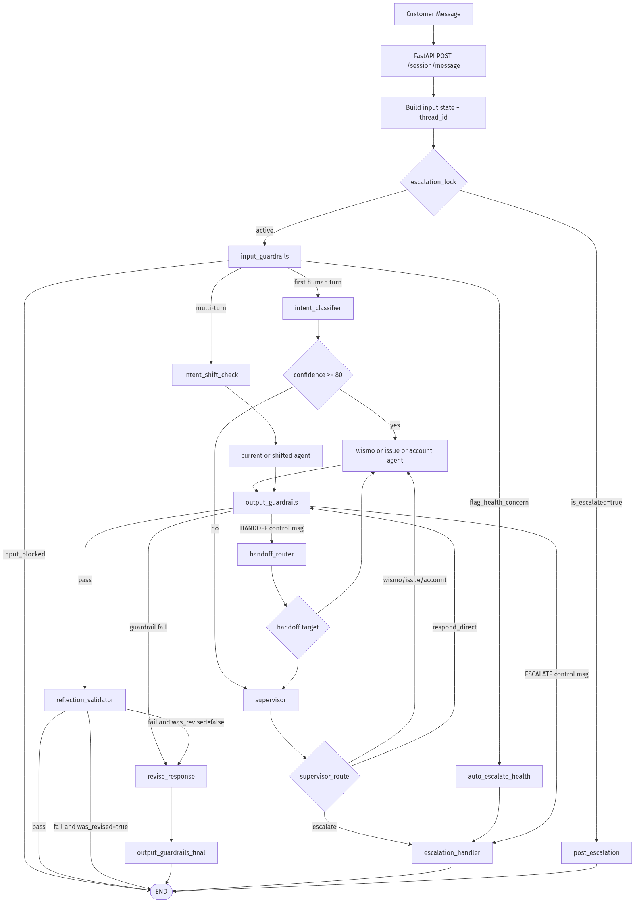
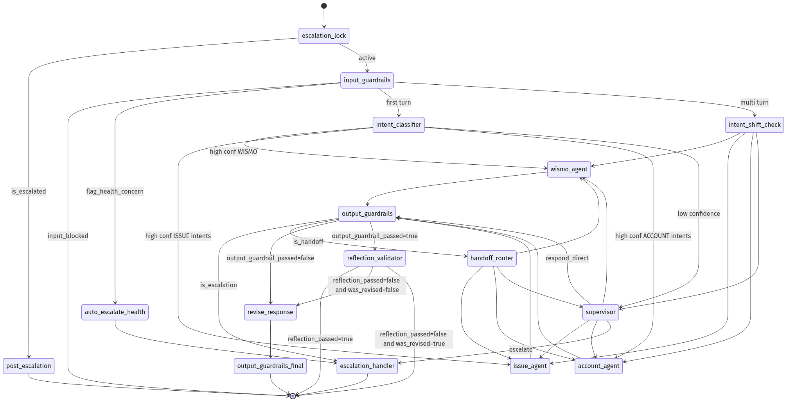
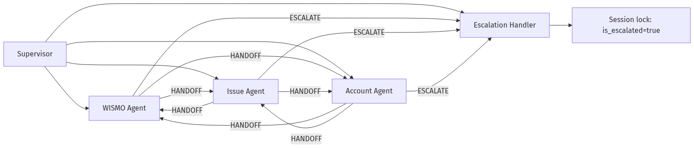
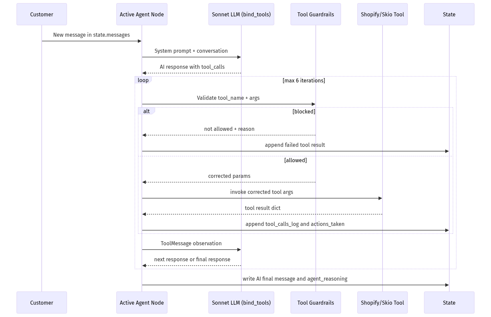
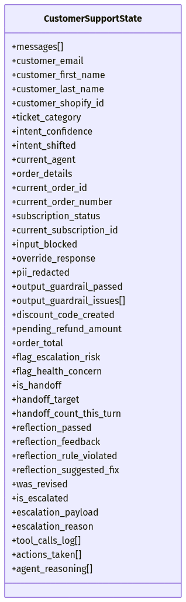
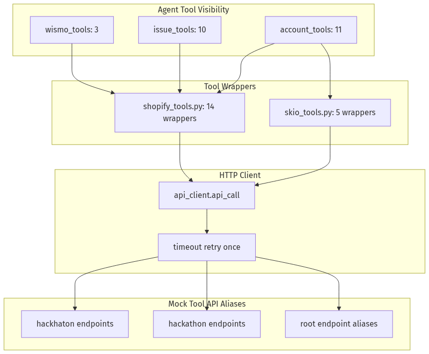
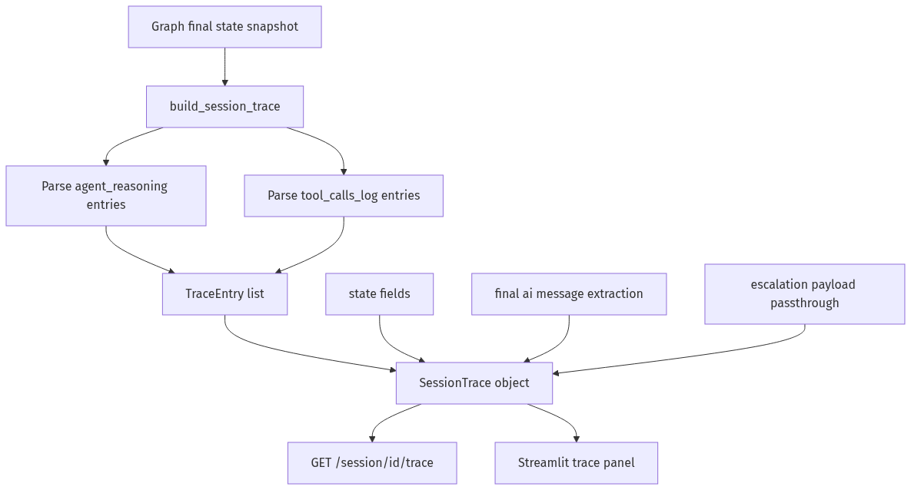
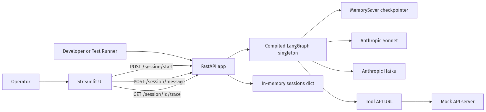

# Lookfor Hackathon Multi-Agent Mimari Raporu (Kod Bazlı, Yeniden Doğrulanmış)

## 1. Rapor Kapsamı ve Doğrulama Metodu
Bu rapor, doğrudan kod tabanı üzerinden yeniden çıkarılmıştır. Kaynak olarak doküman değil, çalışan implementasyonlar esas alınmıştır.

İncelenen ana alanlar:
- API ve orchestration: `src/main.py`, `src/graph/*`
- Agent katmanı: `src/agents/*`
- Pattern katmanı: `src/patterns/*`
- Prompt katmanı: `src/prompts/*`
- Tool katmanı: `src/tools/*`
- Tracing/UI: `src/tracing/*`, `src/ui/streamlit_app.py`
- Mock entegrasyon: `mock-api/mock_api_server.py`, `mock-api/test_mock_api.py`
- Test suite: `tests/test_guardrails.py`, `tests/test_routing.py`, `tests/test_handoff.py`, `tests/test_e2e_conservations.py`, `tests/test_scenario_runner.py`, `tests/test_scenarios.json`

Not: Bu rapor, mevcut workspace state’i için geçerlidir.

---

## 2. Sistem Özeti (Gerçek Implementasyon)
Sistem, FastAPI girişinden LangGraph tabanlı çok katmanlı bir pipeline’a girer ve her müşteri mesajını aşağıdaki sırada işler:
1. Escalation lock
2. Input guardrails
3. Intent classifier veya multi-turn intent shift check
4. Supervisor veya domain ReAct agent
5. Output guardrails
6. Reflection (8 kural)
7. Revision (en fazla 1 döngü)

Kritik gerçekler:
- Graph tek sefer compile edilip singleton olarak tutuluyor: `src/main.py:40`
- Session store memory içi dict: `src/main.py:43`
- Checkpointer memory tabanlı: `src/graph/checkpointer.py:7`
- Intent eşikleri:
  - `CONFIDENCE_THRESHOLD = 80` (`src/config.py:75`)
  - `INTENT_SHIFT_THRESHOLD = 85` (`src/config.py:76`)

---

## 3. Uçtan Uca Akış (Derlenmiş Diyagram)

Kaynak Mermaid: `docs/diagrams/mermaid-src/01-end-to-end-pipeline.mmd`
SVG: `docs/diagrams/rendered/01-end-to-end-pipeline.svg`
PNG: `docs/diagrams/rendered/01-end-to-end-pipeline.png`

---

## 4. LangGraph Routing State Machine

Kaynak Mermaid: `docs/diagrams/mermaid-src/02-langgraph-routing-state.mmd`
SVG: `docs/diagrams/rendered/02-langgraph-routing-state.svg`
PNG: `docs/diagrams/rendered/02-langgraph-routing-state.png`

Node envanteri (toplam 16 node): `src/graph/graph_builder.py:177`-`src/graph/graph_builder.py:192`
- escalation_lock
- input_guardrails
- auto_escalate_health
- intent_classifier
- intent_shift_check
- supervisor
- wismo_agent
- issue_agent
- account_agent
- output_guardrails
- output_guardrails_final
- handoff_router
- reflection_validator
- revise_response
- escalation_handler
- post_escalation

Conditional edge blokları: `src/graph/graph_builder.py:200`, `src/graph/graph_builder.py:207`, `src/graph/graph_builder.py:222`, `src/graph/graph_builder.py:234`, `src/graph/graph_builder.py:246`, `src/graph/graph_builder.py:264`, `src/graph/graph_builder.py:276`, `src/graph/graph_builder.py:288`

---

## 5. Agent Topolojisi

Kaynak Mermaid: `docs/diagrams/mermaid-src/03-agent-topology.mmd`
SVG: `docs/diagrams/rendered/03-agent-topology.svg`
PNG: `docs/diagrams/rendered/03-agent-topology.png`

### 5.1 Supervisor
- Low confidence veya kompleks/karışık taleplerde route verir
- Model: Sonnet
- Çıktı formatı: `ROUTE`, `REASON`, opsiyonel `RESPONSE`
- Kod: `src/agents/supervisor.py`

### 5.2 Domain Agent’lar
- `wismo_agent`: gönderi takibi / gecikme
- `issue_agent`: wrong/missing, no-effect, refund
- `account_agent`: cancellation, address, subscription, discount, positive
- Kod: `src/agents/react_agents.py`

### 5.3 Handoff ve Escalation
- Agent kontrol mesajı formatı:
  - `HANDOFF: target_agent | REASON: ...`
  - `ESCALATE: category | REASON: ...`
- Output guardrail bu kontrol mesajlarını yakalayıp route eder: `src/patterns/guardrails.py`

---

## 6. ReAct Çalışma Döngüsü

Kaynak Mermaid: `docs/diagrams/mermaid-src/04-react-loop.mmd`
SVG: `docs/diagrams/rendered/04-react-loop.svg`
PNG: `docs/diagrams/rendered/04-react-loop.png`

Implementasyon gerçekleri:
- Manual ReAct loop: `src/agents/react_agents.py`
- Maks iterasyon: `max_iterations=6` (`src/agents/react_agents.py:46`)
- Her tool çağrısından önce `tool_call_guardrails` uygulanıyor
- Tool sonuçları `tool_calls_log` içine, kritik aksiyonlar `actions_taken` içine yazılıyor

---

## 7. Guardrail Katmanı (Input / Output / Tool)

### 7.1 Input Guardrails
- Empty/gibberish bloklama
- Prompt injection ve internal probing bloklama
- PII redaction (email/phone/CC/SSN/address)
- Aggressive language flag
- Health concern flag
- Kod: `src/patterns/guardrails.py`

### 7.2 Output Guardrails
- Forbidden phrase kontrolü
- Persona/signature (`Caz`) kontrolü
- Competitor mention kontrolü
- Internal leak pattern kontrolü (`gid://shopify`, `tool_call`, `state.get`, vb.)
- Minimum uzunluk kontrolü
- Control mesaj bypass:
  - `HANDOFF:` -> handoff
  - `ESCALATE:` -> escalation

### 7.3 Tool Call Guardrails
- Lookup/action ID format doğrulama (#order vs GID)
- Destructive işlem parametre doğrulaması
- `shopify_cancel_order` varsayılanları otomatik tamamlama
- Discount policy zorlaması (`percentage`, `0.10`, `48h`)
- Store credit için %10 bonus zorlaması
- Son 3 çağrıda duplicate call engeli

---

## 8. Intent, Supervisor, Reflection, Revision

### 8.1 Intent Classifier
- Model: Haiku
- Çıkış parse formatları:
  - `INTENT|CONFIDENCE`
  - JSON `{"intent":..., "confidence":...}`
- Haiku yoksa classifier fallback (`GENERAL, 50`) var: `src/patterns/intent_classifier.py:76`

### 8.2 Reflection + Revision
- Reflection: Haiku ile 8 kural doğrulama
- Revision: Sonnet ile tek sefer düzeltme
- Revizyon sonrası final guardrail pass-through node
- Kod:
  - Reflection/Revision: `src/patterns/reflection.py`
  - Prompt: `src/prompts/reflection_prompt.py`

---

## 9. Escalation ve Session Lock
- Escalation payload üretimi: `src/agents/escalation.py`
- High priority kategoriler: `health_concern`, `chargeback_risk`, `billing_error`, `technical_error` (`src/agents/escalation.py:32`)
- Escalated hedef: `Monica - Head of CS` (`src/agents/escalation.py:28`)
- Session lock davranışı:
  - `is_escalated=True` -> sonraki mesajlar doğrudan `post_escalation` yanıtına gider

---

## 10. State Şeması

Kaynak Mermaid: `docs/diagrams/mermaid-src/06-state-schema.mmd`
SVG: `docs/diagrams/rendered/06-state-schema.svg`
PNG: `docs/diagrams/rendered/06-state-schema.png`

State merkezi tip: `CustomerSupportState` (`src/graph/state.py`)
Ana bloklar:
- Conversation ve customer context
- Intent/routing alanları
- Shared business context (order/subscription)
- Guardrail alanları
- Reflection alanları
- Escalation alanları
- Trace/observability alanları

---

## 11. Tooling ve Entegrasyon Katmanı

Kaynak Mermaid: `docs/diagrams/mermaid-src/05-tooling-integration.mmd`
SVG: `docs/diagrams/rendered/05-tooling-integration.svg`
PNG: `docs/diagrams/rendered/05-tooling-integration.png`

### 11.1 Tool sayıları
- Wrapper toplamı: 19
  - Shopify: 14
  - Skio: 5
- Agent’ların görebildiği unique tool: 18
- `shopify_create_draft_order` wrapper’ı implement edilmiş ama tool group’larda kullanılmıyor

### 11.2 API Client
- Path: `/{API_URL}/hackhaton/{endpoint}` (`src/tools/api_client.py:17`)
- Tek retry (timeout sonrası) var

### 11.3 Mock API alias desteği
- `mock-api/mock_api_server.py` hem `hackhaton` hem `hackathon` hem root alias route’ları sunuyor
- Bu sayede typo/alias farklarına tolerans var

---

## 12. API Yüzeyi

FastAPI endpointleri (`src/main.py`):
- `GET /health`
- `POST /session/start`
- `POST /session/message`
- `GET /session/{session_id}/trace`
- `GET /sessions`

Mock API admin endpointleri:
- `/admin/reset`, `/admin/state`, `/admin/orders/{email}`, `/admin/add_customer`, `/admin/add_order`, `/admin/add_subscription`

---

## 13. Observability ve Trace

Kaynak Mermaid: `docs/diagrams/mermaid-src/07-observability-trace.mmd`
SVG: `docs/diagrams/rendered/07-observability-trace.svg`
PNG: `docs/diagrams/rendered/07-observability-trace.png`

Trace üretimi:
- `build_session_trace(session_id, state)` (`src/tracing/models.py`)
- Kaynaklar:
  - `agent_reasoning`
  - `tool_calls_log`
  - final AI mesajı
- Çıkış API: `GET /session/{session_id}/trace`

---

## 14. Runtime/Deployment Görünümü

Kaynak Mermaid: `docs/diagrams/mermaid-src/08-deployment-runtime.mmd`
SVG: `docs/diagrams/rendered/08-deployment-runtime.svg`
PNG: `docs/diagrams/rendered/08-deployment-runtime.png`

Önemli runtime gerçekleri:
- `graph = compile_graph()` singleton (`src/main.py:40`)
- Session memory içi dict (`src/main.py:43`)
- Checkpointer `MemorySaver` (`src/graph/checkpointer.py:7`)
- Model adları:
  - Sonnet: `claude-sonnet-4-20250514` (`src/config.py:62`)
  - Haiku: `claude-haiku-4-5-20251001` (`src/config.py:68`)

---

## 15. Test Kapsamı (Gerçek Dosyalardan)

### 15.1 Senaryo veri seti
- `tests/test_scenarios.json` toplam: 112 senaryo
- Kategori dağılımı:
  - DISCOUNT: 4
  - EDGE_CASES: 20
  - ESCALATION: 4
  - GUARDRAILS: 18
  - HANDOFF: 4
  - MULTI_TURN: 6
  - NO_EFFECT: 7
  - ORDER_MODIFY: 11
  - POSITIVE: 4
  - REFUND: 8
  - SUBSCRIPTION: 9
  - WISMO: 11
  - WRONG_MISSING: 6

### 15.2 Test runner’lar
- Aktif büyük runner: `tests/test_scenario_runner.py` (v2.1)
- Legacy runner: `tests/eski_test_runner.py` (v2.0)
- E2E conversation test dosyası: `tests/test_e2e_conservations.py` (dosya adında yazım hatası var)

---

## 16. Kod Bazlı Kritik Bulgular (Düzgünlük ve Drift)

1. Discount limit alanı drift’i:
- Guardrail `discount_code_created_count` bekliyor (`src/patterns/guardrails.py:402`)
- State şeması `discount_code_created: bool` tanımlıyor (`src/graph/state.py:49`)
- Sonuç: cross-turn discount limiti beklenenden farklı davranabilir.

2. Dokümantasyon/tool sayısı drift’i:
- README Issue Agent için 9 tool yazıyor (`README.md:40`)
- Gerçekte `issue_tools` listesi 10 eleman.

3. Docker start script eksikliği:
- `.dockerfile` `start.sh` kopyalıyor (`.dockerfile:16`)
- Repo kökünde `start.sh` yok.

4. README env örnek dosyası drift’i:
- README `.env.example` referans veriyor (`README.md:76`, `README.md:94`)
- Repoda `.env.example` dosyası yok.

5. Handoff implementasyonu iki yerde:
- `src/agents/supervisor.py:104`
- `src/patterns/handoff.py:10`
- Graph import’u `src.patterns.handoff` üzerinden (`src/graph/graph_builder.py:36`).

6. API sözleşmesi drift’i (checklist vs mock gerçek):
- Bazı test dokümanları order response’u 5 field diye anlatıyor.
- Mock `_order_detail` ek alanlar da döndürüyor (`fulfillmentStatus`, `financialStatus`, `lineItems`, `tags`, vb.).

---

## 17. Mermaid Kaynakları ve Derlenmiş Çıktılar

| Diyagram | Mermaid Kaynak | SVG | PNG |
|---|---|---|---|
| 01 | `docs/diagrams/mermaid-src/01-end-to-end-pipeline.mmd` | `docs/diagrams/rendered/01-end-to-end-pipeline.svg` | `docs/diagrams/rendered/01-end-to-end-pipeline.png` |
| 02 | `docs/diagrams/mermaid-src/02-langgraph-routing-state.mmd` | `docs/diagrams/rendered/02-langgraph-routing-state.svg` | `docs/diagrams/rendered/02-langgraph-routing-state.png` |
| 03 | `docs/diagrams/mermaid-src/03-agent-topology.mmd` | `docs/diagrams/rendered/03-agent-topology.svg` | `docs/diagrams/rendered/03-agent-topology.png` |
| 04 | `docs/diagrams/mermaid-src/04-react-loop.mmd` | `docs/diagrams/rendered/04-react-loop.svg` | `docs/diagrams/rendered/04-react-loop.png` |
| 05 | `docs/diagrams/mermaid-src/05-tooling-integration.mmd` | `docs/diagrams/rendered/05-tooling-integration.svg` | `docs/diagrams/rendered/05-tooling-integration.png` |
| 06 | `docs/diagrams/mermaid-src/06-state-schema.mmd` | `docs/diagrams/rendered/06-state-schema.svg` | `docs/diagrams/rendered/06-state-schema.png` |
| 07 | `docs/diagrams/mermaid-src/07-observability-trace.mmd` | `docs/diagrams/rendered/07-observability-trace.svg` | `docs/diagrams/rendered/07-observability-trace.png` |
| 08 | `docs/diagrams/mermaid-src/08-deployment-runtime.mmd` | `docs/diagrams/rendered/08-deployment-runtime.svg` | `docs/diagrams/rendered/08-deployment-runtime.png` |

---

## 18. Sonuç
Mevcut implementasyon, hackathon hedefi için güçlü bir multi-agent orchestrator tasarımı sunuyor:
- Katmanlı güvenlik/kalite kapıları
- Domain bazlı agent ayrımı
- Supervisor fallback ve cross-agent handoff
- Structured escalation + session lock
- İzlenebilir trace modeli

Aynı zamanda üretim kalitesine geçişte öncelikli teknik borç alanları da net:
- session/checkpoint persistence,
- discount state drift’i,
- docker/readme operasyonel drift’leri,
- sözleşme dokümantasyonu ile mock response’un tam hizalanması.
